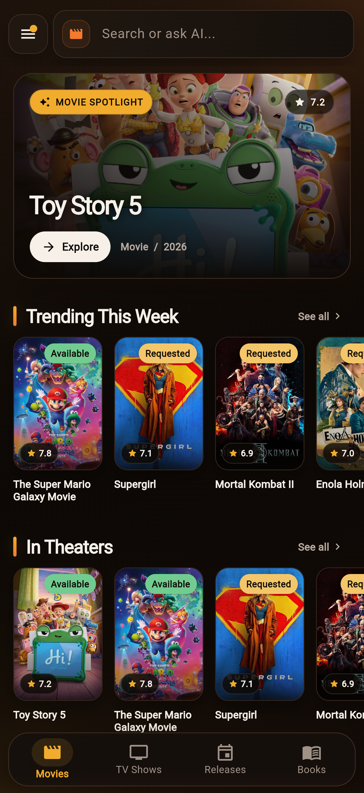
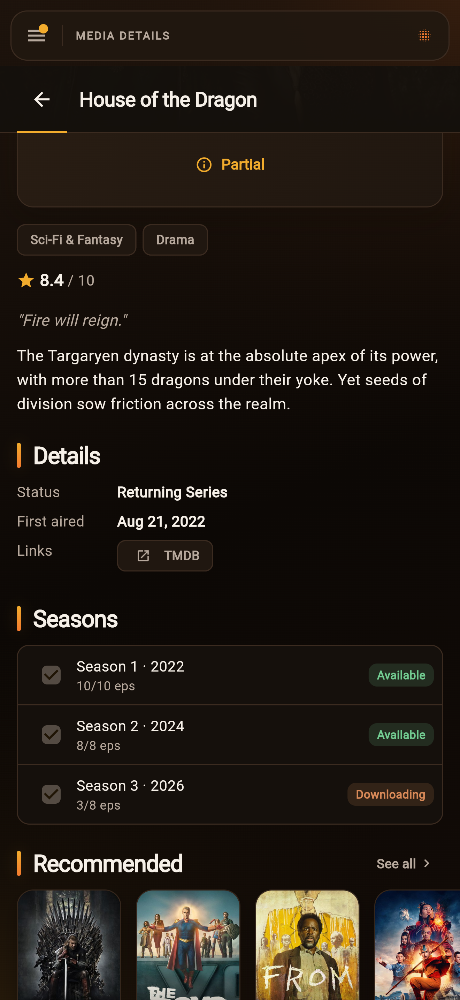
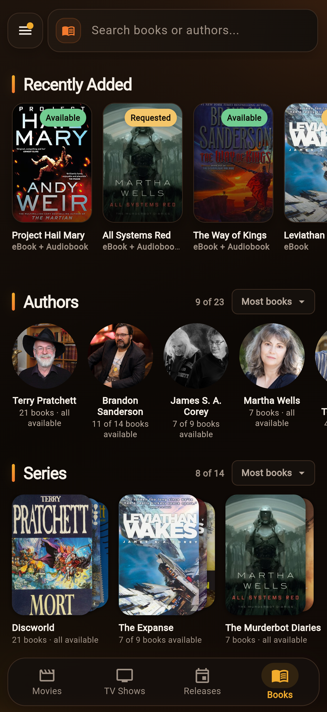
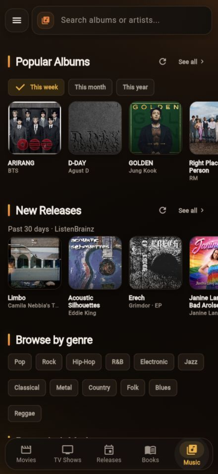

  

<h1 align="center">Cantinarr</h1>

Self-hosted media requests and server management.

  
  
  
  

  
  

  <a href="https://cantinarr.com">Website</a> ·
  <a href="https://docs.cantinarr.com">Documentation</a> ·
  <a href="https://demo.cantinarr.com">Live demo</a>

Cantinarr lets your household browse and request movies, TV shows, ebooks, audiobooks, and music. Administrators manage requests, libraries, and download clients from the same app. It connects to Radarr, Sonarr, Chaptarr, and Lidarr.

## Preview

  
  
  
  

Navigation adapts to your services and permissions.

## Features

- Movie, season, ebook, audiobook, and album requests with approvals and per-user limits.
- Live availability, download progress, and push or Discord notifications.
- Library and download queue management across multiple service instances.
- Plex, Jellyfin, Emby, and Audiobookshelf account access and playback links.
- Connect links, passkeys, Plex sign-in, and OpenID Connect.
- Kids accounts with movie and TV rating limits.
- An optional [AI agent](https://docs.cantinarr.com/use/assistant/) for finding media, making requests, and admin troubleshooting, plus [supervised repairs](https://docs.cantinarr.com/admin/remediation/) for persistent download problems.
- An [MCP server](https://docs.cantinarr.com/integrations/mcp/) and a [Seerr-compatible API](https://docs.cantinarr.com/integrations/seerr-api/) for external tools.

## Getting started

Run the server with [Docker](https://docs.cantinarr.com/install/docker/), [Unraid](https://docs.cantinarr.com/install/platforms/), or a [Linux binary](https://docs.cantinarr.com/install/linux/), then follow the [setup guide](https://docs.cantinarr.com/start/quickstart/) to connect your services and invite your household.

The web app is included. Mobile apps connect to your server and are available in beta:

- **iPhone and iPad:** [TestFlight](https://testflight.apple.com/join/bCPDwCsD)
- **Android:** [Google Play](https://play.google.com/apps/testing/codes.julian.cantinarr)

## Documentation

- [Using Cantinarr](https://docs.cantinarr.com/start/for-households/)
- [Configuration](docs/configuration.md) and [integrations](https://docs.cantinarr.com/integrations/)
- [Troubleshooting](https://docs.cantinarr.com/troubleshooting/)
- [API reference](server/README.md#api-reference) and [building from source](https://docs.cantinarr.com/contributing/development/)

## Community

Join [Discord](https://discord.gg/zAgRwGwmVB) for help and discussion. Report bugs on [GitHub](https://github.com/windoze95/cantinarr/issues) or suggest and vote on features on the [roadmap](https://cantinarr.com/roadmap/).

Pull requests are welcome. See the [contributor guide](https://docs.cantinarr.com/contributing/development/) and [repository instructions](AGENTS.md). You can support development through [GitHub Sponsors](https://github.com/sponsors/windoze95).

## License

[AGPL-3.0](LICENSE). Copyright (c) 2026 Julian Dice.

This product uses the TMDB API but is not endorsed or certified by [TMDB](https://www.themoviedb.org/).
